# 🚀 Linux Server Provisioning & Administration Toolkit


A modular **Linux Administration Toolkit** developed using **Bash Shell Scripting** to automate common system administration tasks such as server monitoring, health reporting, service management, backups, cleanup, package updates, and user management.

This project demonstrates practical Linux administration skills and follows a structured, menu-driven approach similar to tools used in real-world server environments.

---

# 📑 Table of Contents

- Project Overview
- Features
- Project Structure
- Requirements
- Installation
- How to Run
- Toolkit Menu
- Scripts
- Screenshots
- Reports
- Future Improvements
- Skills Demonstrated
- Author
- License

---

# 📖 Project Overview

Managing Linux servers manually becomes repetitive and time-consuming.

This toolkit automates common Linux administration activities including:

- Server Information Collection
- CPU Monitoring
- Memory Monitoring
- Disk Monitoring
- Service Status Monitoring
- Complete Health Report Generation
- Backup Utility
- Cleanup Utility
- Package Update Utility
- User Management

The project is completely menu-driven and designed to simplify routine Linux administration tasks.

---

# ✨ Features

- Interactive Menu Driven Toolkit
- Linux System Information
- Disk Usage Monitoring
- Memory Monitoring
- CPU Monitoring
- Service Status Monitoring
- Server Health Report
- Backup Utility
- Cleanup Utility
- Package Update Utility
- User Management Utility
- Automatic Report Generation
- Organized Project Structure
- Screenshots Included
- Easy to Extend

---

# 📂 Project Structure

```text
linux-server-provisioning-toolkit/

├── assets
│   ├── diagrams
│   └── screenshots
│       ├── backup.png
│       ├── cleanup.png
│       ├── cpu-monitor.png
│       ├── disk-monitor.png
│       ├── health-report.png
│       ├── memory-monitor.png
│       ├── service-check.png
│       ├── system-info.png
│       ├── toolkit-menu-one.png
│       ├── toolkit-menu-two.png
│       ├── update-server.png
│       └── user-management.png
│
├── docs
│
├── reports
│   └── backups
│
├── scripts
│   ├── backup.sh
│   ├── cleanup.sh
│   ├── common.sh
│   ├── cpu-monitor.sh
│   ├── disk-monitor.sh
│   ├── health-report.sh
│   ├── memory-monitor.sh
│   ├── service-check.sh
│   ├── system-info.sh
│   ├── toolkit.sh
│   ├── update-server.sh
│   └── user-management.sh
│
├── LICENSE
└── README.md
```

---

# 🛠 Requirements

- Ubuntu Linux (Tested)
- Bash
- systemctl
- awk
- grep
- sed
- tar
- find
- df
- free
- lscpu

---

# ⚙ Installation

Clone the repository:

```bash
git clone https://github.com/mansinawariya/linux-server-provisioning-toolkit.git
```

Navigate to the project:

```bash
cd linux-server-provisioning-toolkit
```

Make scripts executable:

```bash
chmod +x scripts/*.sh
```

Run the toolkit:

```bash
./scripts/toolkit.sh
```

---

# ▶️ How to Run

Launch the toolkit using:

```bash
./scripts/toolkit.sh
```

The toolkit provides an interactive menu to access all Linux administration utilities.

---

# 📋 Toolkit Menu

```text
==============================================================
      Linux Server Provisioning & Administration Toolkit
==============================================================

Monitoring
--------------------------------------------------------------
1.  System Information
2.  Disk Monitoring
3.  Memory Monitoring
4.  CPU Monitoring
5.  Service Status
6.  Health Report

Administration
--------------------------------------------------------------
7.  User Management
8.  Backup Utility
9.  Cleanup Utility
10. Update Server

Reports
--------------------------------------------------------------
11. Generate All Reports

0. Exit
```

---

# 📜 Script Descriptions

This toolkit is modular. Each script performs a specific Linux administration task.

---

## 1️⃣ toolkit.sh

**Purpose**

Acts as the main entry point of the project.

### Responsibilities

- Displays the interactive menu
- Executes selected scripts
- Generates all reports
- Provides a centralized interface

---

## 2️⃣ system-info.sh

Displays detailed Linux system information.

### Information Collected

- Hostname
- Current User
- Operating System
- Kernel Version
- Architecture
- Uptime
- IP Address
- CPU Model
- Total RAM
- Disk Usage

### Linux Commands Used

- hostname
- uname
- hostname -I
- whoami
- lscpu
- free
- df
- uptime

---

## 3️⃣ disk-monitor.sh

Monitors disk utilization.

### Displays

- Filesystem
- Total Space
- Used Space
- Available Space
- Disk Usage Percentage
- Mount Point
- Health Status

### Linux Commands Used

- df
- awk

---

## 4️⃣ memory-monitor.sh

Monitors RAM utilization.

### Displays

- Total Memory
- Used Memory
- Free Memory
- Memory Usage Percentage
- Health Status

### Linux Commands Used

- free
- awk

---

## 5️⃣ cpu-monitor.sh

Monitors processor information.

### Displays

- CPU Model
- Architecture
- Number of CPU Cores
- Load Average
- CPU Health Status

### Linux Commands Used

- lscpu
- uptime
- nproc
- awk

---

## 6️⃣ service-check.sh

Checks important Linux services.

### Services

- SSH
- Cron
- NetworkManager
- Docker
- Nginx
- Apache

### Displays

- Running
- Stopped
- Not Installed

### Linux Commands Used

- systemctl

---

## 7️⃣ health-report.sh

Generates a complete Linux server health report.

### Includes

- Hostname
- Operating System
- Kernel
- IP Address
- Uptime
- CPU Status
- Memory Status
- Disk Status
- Overall Health

This is one of the core scripts of the project.

---

## 8️⃣ backup.sh

Creates compressed backups of user-selected directories.

### Features

- Directory validation
- Compressed archive generation
- Timestamped backup filename
- Backup size display

### Linux Commands Used

- tar
- du
- mkdir

---

## 9️⃣ cleanup.sh

Safely cleans temporary files.

### Features

- Preview temporary files
- Confirmation before cleanup
- Safe execution
- Displays storage information

### Linux Commands Used

- find
- du
- rm

---

## 🔟 update-server.sh

Updates installed packages safely.

### Features

- Package list update
- Package upgrade
- Remove unused packages
- Confirmation before execution

### Linux Commands Used

- apt update
- apt upgrade
- apt autoremove

---

## 1️⃣1️⃣ user-management.sh

Linux user management utility.

### Features

- List Users
- Check User
- Create User (Preview)
- Delete User (Preview)
- Lock User (Preview)
- Unlock User (Preview)

### Linux Commands Used

- id
- cut
- passwd
- useradd
- userdel

---

# 📊 Report Generation

The toolkit can automatically generate reports for monitoring scripts.

Generated reports include:

- System Information Report
- Disk Usage Report
- Memory Report
- CPU Report
- Service Status Report
- Health Report

Reports are stored inside the **reports/** directory.

---

# 🎯 Learning Objectives

This project helped in understanding:

- Bash Shell Scripting
- Linux File System
- Linux Commands
- System Monitoring
- Service Management
- User Management
- Backup Automation
- Package Management
- Menu-Driven Shell Applications
- Modular Bash Project Structure

---

# 📸 Project Screenshots

The following screenshots demonstrate the functionality of each module in the Linux Server Provisioning & Administration Toolkit.

---


## 📋 Main Menu (Reports Section)

Report generation and administration options.

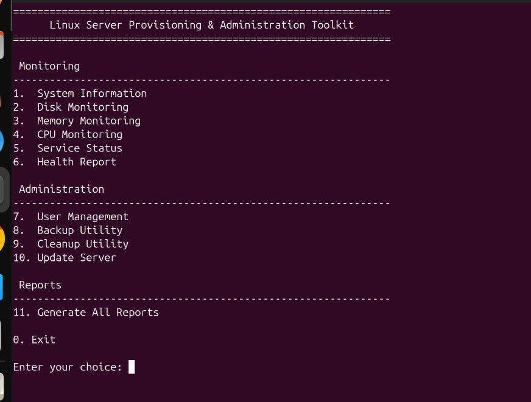

---

## 💻 System Information

Displays comprehensive Linux system information including hostname, kernel version, operating system, architecture, uptime, IP address, CPU model, RAM and disk usage.

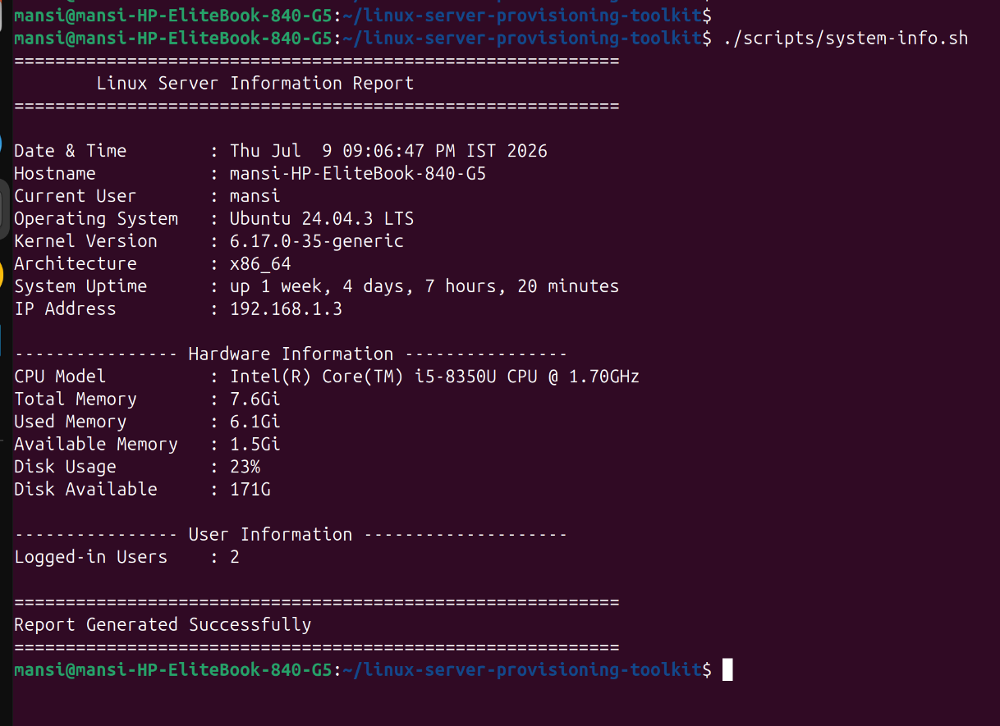

---

## 💾 Disk Monitoring

Shows current disk utilization, total storage, used space, available space and overall disk health.

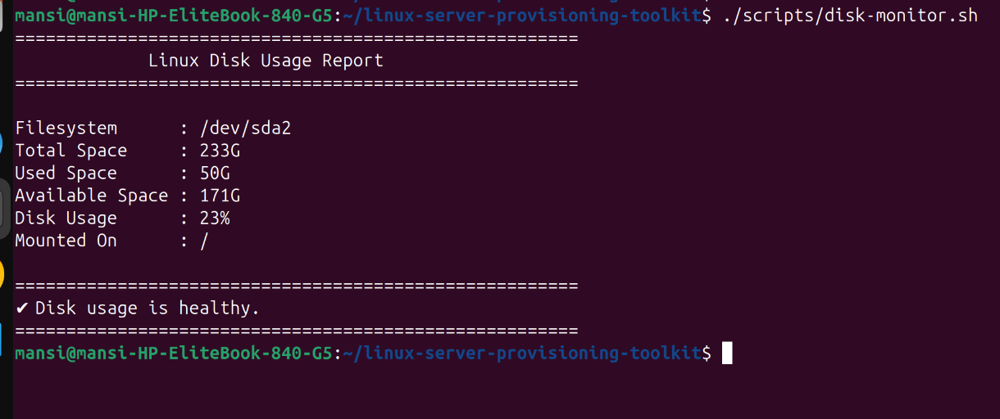

---

## 🧠 Memory Monitoring

Displays RAM statistics including total memory, used memory, free memory and memory health status.

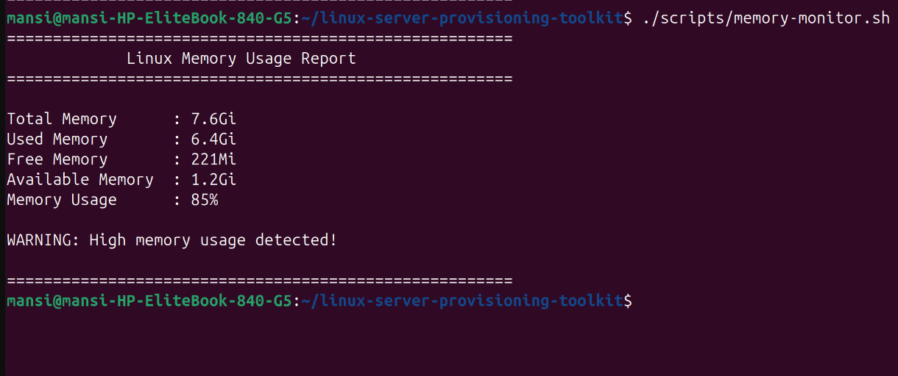

---

## ⚙ CPU Monitoring

Displays processor model, architecture, number of CPU cores, system load average and CPU status.

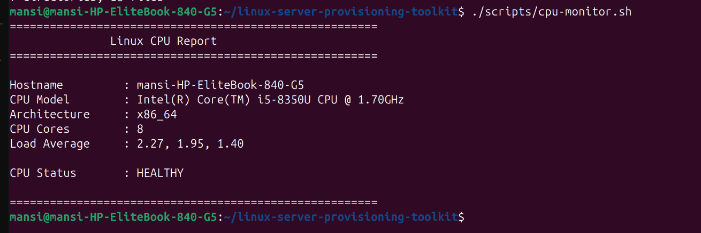

---

## 🔧 Service Status

Checks important Linux services and displays whether they are Running, Stopped or Not Installed.

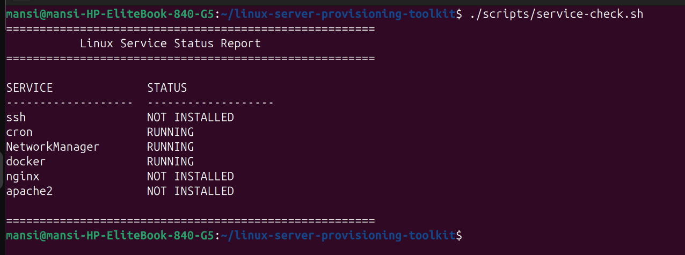

---

## ❤️ Health Report

Provides a consolidated server health report by combining CPU, Memory, Disk and System Information into a single report.

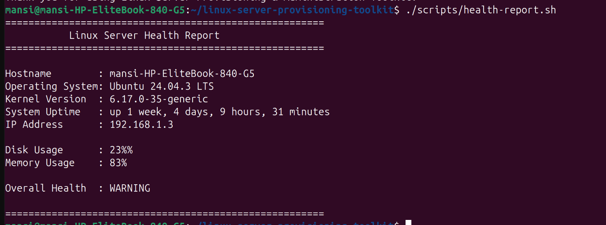

---

## 💼 Backup Utility

Creates compressed backups of user-selected directories using timestamp-based archive names.

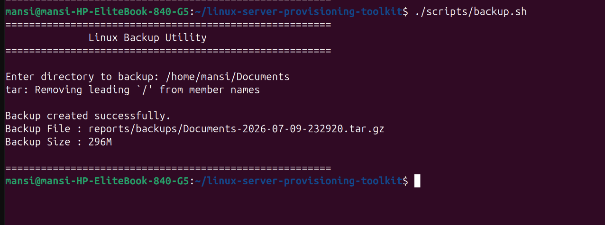

---

## 🧹 Cleanup Utility

Safely previews and cleans temporary files after user confirmation.

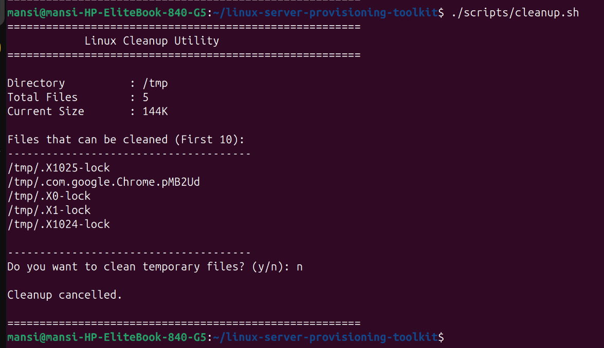

---

## 🔄 Update Server

Updates package lists, upgrades installed packages and removes unnecessary packages safely.

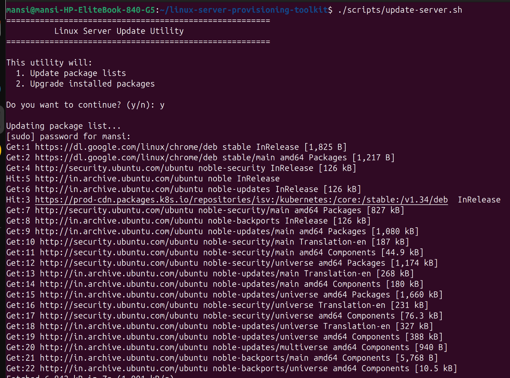

---

## 👤 User Management

Menu-driven Linux user management utility with preview mode for administrative operations.

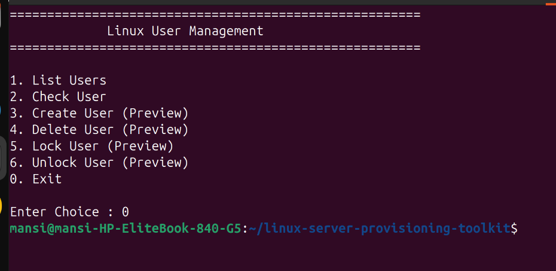

---

# 📂 Reports Directory

Monitoring reports generated by the toolkit are stored inside the **reports/** directory.

Example:

```text
reports/

system-info-report.txt

disk-report.txt

memory-report.txt

cpu-report.txt

service-report.txt

health-report.txt

backups/
```

---

# 💡 Design Principles

This project follows several software engineering best practices:

- Modular Bash scripting
- Menu-driven architecture
- Separation of monitoring and administration tasks
- Safe execution for administrative operations
- Readable terminal output
- Organized folder structure
- Reusable scripts
- Easy maintenance
- Beginner-friendly implementation
- Extensible project architecture

---

# 🧪 Testing

The toolkit has been tested on:

- Ubuntu Linux
- Bash Shell
- Standard Linux command-line utilities

Each monitoring script was executed individually and also tested through the integrated toolkit menu.

---

# 📝 Sample Workflow

1. Launch the toolkit.
2. Select the required administration task.
3. Execute monitoring or maintenance operation.
4. Review the output on the terminal.
5. Generate reports when required.
6. Exit the toolkit.

---

# 🚀 Future Improvements

The current version (v1.0) provides a complete Linux Administration Toolkit. Future enhancements may include:

- Colorized terminal output
- Log file management
- Email notification support
- Cron job automation
- Configuration file support
- Interactive dashboard
- System resource graphs
- Docker container monitoring
- Nginx and Apache virtual host management
- Automatic scheduled backups
- Restore backup functionality
- Report history with timestamps
- Export reports in PDF or HTML format
- Prometheus integration
- Grafana dashboard integration
- Ansible automation support

---

# 🛠 Skills Demonstrated

This project demonstrates practical knowledge of:

### Linux Administration

- Linux File System
- User Management
- Package Management
- Service Management
- Process Monitoring
- Disk Management
- Memory Monitoring
- CPU Monitoring

### Bash Scripting

- Variables
- Conditional Statements
- Loops
- Functions
- Case Statements
- User Input
- File Operations
- Error Handling
- Modular Script Design

### System Commands

- hostname
- uname
- uptime
- whoami
- hostname -I
- lscpu
- free
- df
- systemctl
- tar
- du
- awk
- grep
- find
- cut

### Software Engineering Practices

- Modular Project Structure
- Reusable Scripts
- Menu Driven Interface
- Organized Documentation
- Screenshot Based Documentation
- Version Control with Git
- GitHub Project Hosting

---

# 🎯 Resume Description

**Linux Server Provisioning & Administration Toolkit**

Designed and developed a modular Bash-based Linux Administration Toolkit that automates common server administration tasks including:

- System Information Collection
- CPU Monitoring
- Memory Monitoring
- Disk Monitoring
- Service Status Monitoring
- Health Report Generation
- Backup Utility
- Cleanup Utility
- Linux Package Update
- User Management

The toolkit follows a menu-driven architecture and demonstrates practical Linux administration and shell scripting skills.

---

# 📈 What I Learned

During this project I gained hands-on experience with:

- Linux system administration
- Bash shell scripting
- Linux monitoring commands
- Modular project organization
- Git and GitHub workflow
- Documentation writing
- Real-world scripting practices
- Building reusable command-line tools

---

# 🤝 Contributing

Contributions, suggestions, and improvements are welcome.

If you would like to contribute:

1. Fork the repository.
2. Create a new feature branch.
3. Commit your changes.
4. Push the branch.
5. Open a Pull Request.

---

# 📄 License

This project is licensed under the MIT License.

See the **LICENSE** file for more information.

---

# 👩‍💻 Author

**Mansi Nawariya**

Aspiring Linux & DevOps Engineer

GitHub:
https://github.com/mansinawariya

---

# ⭐ Support

If you found this project helpful:

- ⭐ Star this repository
- 🍴 Fork the repository
- 💡 Share your feedback
- 🤝 Suggest improvements

---

# 📌 Project Status

**Version:** 1.0

**Status:** Completed

This project is actively maintained and will continue to evolve with additional Linux administration and automation features.

---

## Thank You!

Thank you for visiting this repository.

Happy Learning and Happy Scripting! 🚀